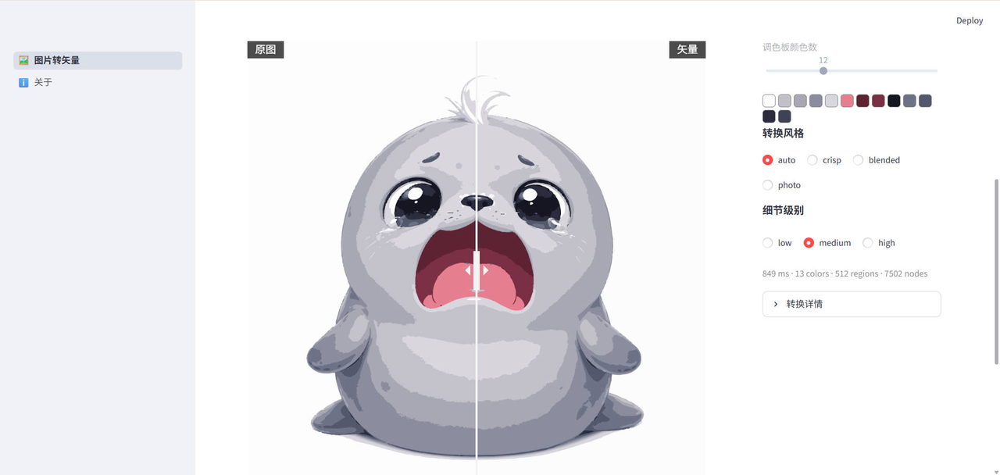

<div align="center">
  <h1>🐵 Goku Image-to-SVG Tool</h1>
  <p><em>A Vecto-powered image vectorizer: upload a bitmap, get a clean, editable SVG in seconds.</em></p>
</div>

<p align="center">
  <a href="README_EN.md"></a>
  <a href="README.md"></a>
  <a href="LICENSE"></a>
  <a href="https://github.com/goku-open/goku-image-to-svg-tool/stargazers"></a>
  
  
</p>

<p align="center">
  
</p>

Wraps the Vecto command-line engine (an open-source .NET vectorization core) in a Streamlit web UI: no shell commands needed — upload an image and it converts instantly, tweak parameters and it re-converts on the fly, compare original / vector / segmentation views side by side, and export SVG or PNG at any scale factor.

## Why the Goku Image-to-SVG Tool?

- **Upload-to-convert, tweak-to-reconvert**: skip the terminal; drop an image and tracing starts automatically, parameter changes produce results immediately
- **Fully aligned with original Vecto parameters**: palette (auto or fixed color count, with color swatch preview), style, detail, and diagnostic stats match the Vecto CLI exactly
- **Drag-to-compare**: switch between original / vector / segmentation views in one click, review before you export
- **Zero-config setup**: the single-file engine binary ships in the repo (`tools/vecto`, v0.4.2 linux-x64); one command and it runs
- **Bilingual interface**: switch between Chinese and English in one click
- **Cloud-ready**: runs free on Streamlit Community Cloud; measured peak memory is 60–490 MB per conversion — comfortable for personal use

## Comparison

| Capability | Goku Image-to-SVG | Vectorizer.AI | Illustrator Image Trace | Inkscape Trace Bitmap | vecto CLI (bare) |
|------|:---:|:---:|:---:|:---:|:---:|
| Open source & free | ✅ | ❌ | ❌ | ✅ | ✅ |
| Browser-based, no install | ✅ | ✅ | ❌ | ❌ | ❌ |
| Auto-convert on upload | ✅ | ✅ | ❌ | ❌ | ❌ |
| Palette / style / detail params | ✅ | ✅ | ✅ | ✅ | ✅ (CLI) |
| Segmentation view + slider | ✅ | Partial | ❌ | ❌ | ❌ |
| Bilingual (ZH/EN) UI | ✅ | Partial | Partial | ✅ | ❌ |

> Comparison is based on publicly documented capabilities; features evolve, so always check the actual product.

## Installation / Use Online

**Use online (recommended)**: [image-to-svg.streamlit.app](https://image-to-svg.streamlit.app) — no install, open and go.

To run locally:

```bash
git clone https://github.com/goku-open/goku-image-to-svg-tool.git
cd goku-image-to-svg-tool
pip install -r requirements.txt
streamlit run streamlit_app.py
```

Open <http://localhost:8501>. The `tools/vecto` binary is bundled (v0.4.2 linux-x64); to download it yourself, see [Vecto Releases](https://github.com/DanielMevit/Vecto/releases).

## Usage

After startup your browser shows:

```
  You can now view your Streamlit app in your browser.

  Local URL: http://localhost:8501
  Network URL: http://192.168.x.x:8501
```

1. **Upload an image**: PNG / JPG / BMP / GIF / TGA / TIFF / WebP / PBM / PPM supported; conversion starts automatically
2. **Tune parameters**: the right panel mirrors the Vecto CLI — palette (auto or fixed color count with swatches), style, detail; changes re-trace instantly
3. **Review**: drag the slider to compare original / vector / segmentation views
4. **Export**: download the SVG, or render a PNG at any scale factor

## How It Works

```
Streamlit frontend ──subprocess──▶ tools/vecto trace (bitmap → SVG)──▶ parse stats
      ▲                                                                     │
      └──────────── slider compare + export SVG / PNG (render) ◀────────────┘
```

The vectorization core is [Vecto](https://github.com/DanielMevit/Vecto) (.NET, MIT): ImageSharp decodes the image and polygon fitting produces vector paths. This project adds the web interaction, parameter passthrough, three-view comparison, and export.

## Contributing & Development

- Tests: `python -m pytest` (every feature ships with tests)
- Pages live in `pages_content/`, logic in `utils.py`, copy in `locales/`
- Issues and PRs welcome; keep the test suite green

## Support

I have two cats, Tangyuan and Jiaozi. If the Goku Image-to-SVG Tool brings you joy, you can feed them [some canned food 🥩](https://ko-fi.com/gokuscraper).

## License

[MIT](LICENSE) © 2026 Goku-Scraper. Vecto engine © Daniel Mevit.

---

*Keywords: image to vector, raster to svg, image tracing, bitmap to svg, svg converter, vector graphics, online vectorizer, vecto engine, streamlit app, open source, free, 图片转矢量, 位图转SVG, 图片矢量化, svg 转换, 免费开源*